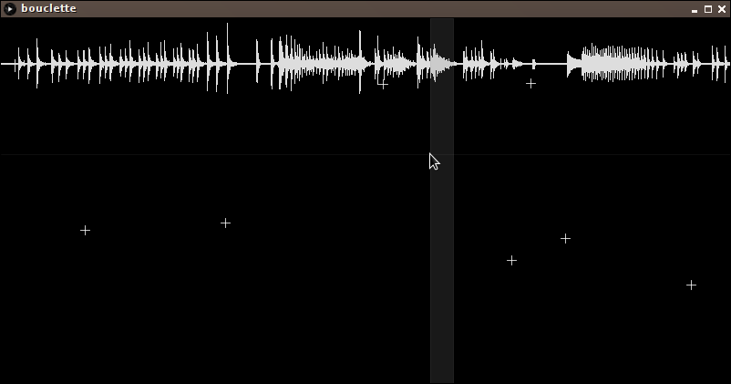

# bouclette

Synthé software pour créer des petites boucles très rapidement dans un fichier sonore.  
Avec comme objectif de pouvoir jouer des grains sonores rapidement dans un fichier son.  
Réalisé avec Processing pour l'interface graphique, ChucK pour le moteur sonore + sox et audiowaveform pour créer l'image de la forme d'onde.  
En somme beaucoup trop de logiciels mais bon...



## Utilisation

Tout se démarre dans un terminal de commandes

Placer les fichiers (wav, mono) dans le dossier du sketch.  

Démarrer avec
```
chuck --loop &                      # lancer la machine virtuelle de ChucK
sh bouclette.sh son1.wav 12012 &    # ouvrir une fenêtre pour son1
sh bouclette.sh son2.wav 12013 &    # ouvrir une fenêtre pour son2
```
/!\ Chaque instance doit être reliée à un port OSC différent

À la fin on arrête ChucK
```
chuck --kill
```
## Améliorations possibles

Simplifier l'utilisation!  
Ajouter du volume  
Boîte de choix de la longueur exponentielle (en se rapprochant du haut, la longueur devrait augmenter beaucoup plus)  
